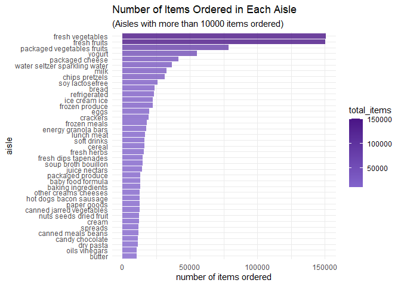

p8105_hw3_bz2570
================
Boran Zhai
2025-10-09

## Problem 1

#### Import the data

``` r
library(p8105.datasets)
data("instacart")
```

#### A short description of the dataset(Inline R code)

The dataset instacart contains 1384617 rows and 15 columns, with the
following variables: order_id, product_id, add_to_cart_order, reordered,
user_id, eval_set, order_number, order_dow, order_hour_of_day,
days_since_prior_order, product_name, aisle_id, department_id, aisle,
department. <br/>

The dataset has the following structure:<br/>

``` r
str(instacart)
```

    ## tibble [1,384,617 × 15] (S3: tbl_df/tbl/data.frame)
    ##  $ order_id              : int [1:1384617] 1 1 1 1 1 1 1 1 36 36 ...
    ##  $ product_id            : int [1:1384617] 49302 11109 10246 49683 43633 13176 47209 22035 39612 19660 ...
    ##  $ add_to_cart_order     : int [1:1384617] 1 2 3 4 5 6 7 8 1 2 ...
    ##  $ reordered             : int [1:1384617] 1 1 0 0 1 0 0 1 0 1 ...
    ##  $ user_id               : int [1:1384617] 112108 112108 112108 112108 112108 112108 112108 112108 79431 79431 ...
    ##  $ eval_set              : chr [1:1384617] "train" "train" "train" "train" ...
    ##  $ order_number          : int [1:1384617] 4 4 4 4 4 4 4 4 23 23 ...
    ##  $ order_dow             : int [1:1384617] 4 4 4 4 4 4 4 4 6 6 ...
    ##  $ order_hour_of_day     : int [1:1384617] 10 10 10 10 10 10 10 10 18 18 ...
    ##  $ days_since_prior_order: int [1:1384617] 9 9 9 9 9 9 9 9 30 30 ...
    ##  $ product_name          : chr [1:1384617] "Bulgarian Yogurt" "Organic 4% Milk Fat Whole Milk Cottage Cheese" "Organic Celery Hearts" "Cucumber Kirby" ...
    ##  $ aisle_id              : int [1:1384617] 120 108 83 83 95 24 24 21 2 115 ...
    ##  $ department_id         : int [1:1384617] 16 16 4 4 15 4 4 16 16 7 ...
    ##  $ aisle                 : chr [1:1384617] "yogurt" "other creams cheeses" "fresh vegetables" "fresh vegetables" ...
    ##  $ department            : chr [1:1384617] "dairy eggs" "dairy eggs" "produce" "produce" ...
    ##  - attr(*, "spec")=
    ##   .. cols(
    ##   ..   order_id = col_integer(),
    ##   ..   product_id = col_integer(),
    ##   ..   add_to_cart_order = col_integer(),
    ##   ..   reordered = col_integer(),
    ##   ..   user_id = col_integer(),
    ##   ..   eval_set = col_character(),
    ##   ..   order_number = col_integer(),
    ##   ..   order_dow = col_integer(),
    ##   ..   order_hour_of_day = col_integer(),
    ##   ..   days_since_prior_order = col_integer(),
    ##   ..   product_name = col_character(),
    ##   ..   aisle_id = col_integer(),
    ##   ..   department_id = col_integer(),
    ##   ..   aisle = col_character(),
    ##   ..   department = col_character()
    ##   .. )

Description for some key variables:<br/> order_id: The unique
identification of order for every user <br/> product_id: The unique
identification for every product <br/> user_id: The unique
identification of every user <br/> reordered: The number of reordered
product <br/> aisle_id: The identification of aisle <br/> aisle: Product
subcategory <br/> department: Major product category <br/>
add_to_cart_order: Sequence position when item was added to cart <br/>
days_since_prior_order: Days since user’s previous order <br/>

Some illustrative examples of observations are as follows:

``` r
instacart |> 
head() |> 
  knitr::kable()
```

| order_id | product_id | add_to_cart_order | reordered | user_id | eval_set | order_number | order_dow | order_hour_of_day | days_since_prior_order | product_name | aisle_id | department_id | aisle | department |
|---:|---:|---:|---:|---:|:---|---:|---:|---:|---:|:---|---:|---:|:---|:---|
| 1 | 49302 | 1 | 1 | 112108 | train | 4 | 4 | 10 | 9 | Bulgarian Yogurt | 120 | 16 | yogurt | dairy eggs |
| 1 | 11109 | 2 | 1 | 112108 | train | 4 | 4 | 10 | 9 | Organic 4% Milk Fat Whole Milk Cottage Cheese | 108 | 16 | other creams cheeses | dairy eggs |
| 1 | 10246 | 3 | 0 | 112108 | train | 4 | 4 | 10 | 9 | Organic Celery Hearts | 83 | 4 | fresh vegetables | produce |
| 1 | 49683 | 4 | 0 | 112108 | train | 4 | 4 | 10 | 9 | Cucumber Kirby | 83 | 4 | fresh vegetables | produce |
| 1 | 43633 | 5 | 1 | 112108 | train | 4 | 4 | 10 | 9 | Lightly Smoked Sardines in Olive Oil | 95 | 15 | canned meat seafood | canned goods |
| 1 | 13176 | 6 | 0 | 112108 | train | 4 | 4 | 10 | 9 | Bag of Organic Bananas | 24 | 4 | fresh fruits | produce |

#### 1. How many aisles, and which are most popular?

``` r
aisles <- instacart |> 
  group_by(aisle) |> 
  summarize(total_items = n()) |> 
  arrange(desc(total_items))
cat("Total number of aisles:", nrow(aisles), "\n")
```

    ## Total number of aisles: 134

``` r
aisles |> 
  head(5) |> 
  knitr::kable(digits = 1)
```

| aisle                      | total_items |
|:---------------------------|------------:|
| fresh vegetables           |      150609 |
| fresh fruits               |      150473 |
| packaged vegetables fruits |       78493 |
| yogurt                     |       55240 |
| packaged cheese            |       41699 |

The top 5 aisles are fresh vegetables, fresh fruits, packaged vegetables
fruits, yogurt, packaged cheese. <br/>

#### 2. Make a plot that shows the number of items ordered in each aisle, limiting this to aisles with more than 10000 items ordered.

``` r
aisle_data <- instacart |> 
  group_by(aisle) |> 
  summarize(total_items = n()) |> 
  filter(total_items > 10000) |> 
  mutate(aisle = fct_reorder(aisle, total_items))

aisle_plot <- aisle_data |> 
  ggplot(aes(x = total_items, y = aisle, fill = total_items)) +
  geom_col(alpha = 0.8) +
  scale_fill_gradient(low = "#8264CC", high = "#4a1486") +
  labs(
    title = "Number of Items Ordered in Each Aisle",
    subtitle = "(Aisles with more than 10000 items ordered)",
    x = "number of items ordered",
    y = "aisle",
  ) +
  theme_minimal()
print(aisle_plot)
```

<!-- --> The
plot shows the number of items ordered in each aisle, and it is ordered
by descending order.

#### 3. Make a table showing the three most popular items in each of the aisles “baking ingredients”, “dog food care”, and “packaged vegetables fruits”. Include the number of times each item is ordered in your table.

``` r
popular_items_table <- instacart |> 
  filter(aisle %in% c("baking ingredients", "dog food care", "packaged vegetables fruits")) |> 
  count(aisle, product_name, name = "order_num") |> 
  group_by(aisle) |> 
  slice_max(order_num, n = 3) |> 
  arrange(aisle, desc(order_num))
popular_items_table |> 
  knitr::kable()
```

| aisle | product_name | order_num |
|:---|:---|---:|
| baking ingredients | Light Brown Sugar | 499 |
| baking ingredients | Pure Baking Soda | 387 |
| baking ingredients | Cane Sugar | 336 |
| dog food care | Snack Sticks Chicken & Rice Recipe Dog Treats | 30 |
| dog food care | Organix Chicken & Brown Rice Recipe | 28 |
| dog food care | Small Dog Biscuits | 26 |
| packaged vegetables fruits | Organic Baby Spinach | 9784 |
| packaged vegetables fruits | Organic Raspberries | 5546 |
| packaged vegetables fruits | Organic Blueberries | 4966 |

In the baking ingredients aisle, the most popular item is Light Brown
Sugar with 499 orders. <br/>

In the dog food care aisle, the most popular item is Snack Sticks
Chicken & Rice Recipe Dog Treats with 30 orders. <br/>

In the packaged vegetables fruits aisle, the most popular item is
Organic Baby Spinach with 9784 orders. <br/>

#### 4. Make a table showing the mean hour of the day at which Pink Lady Apples and Coffee Ice Cream are ordered on each day of the week; format this table for human readers (i.e. produce a 2 x 7 table).

``` r
mean_order_hod <- instacart |>       # mean hour of the day
  filter(product_name %in% c("Pink Lady Apples", "Coffee Ice Cream")) |> 
  group_by(product_name, order_dow) |> 
  summarize(mean_order_hour = mean(order_hour_of_day, na.rm = TRUE), .groups = "drop") |> 
  mutate(mean_order_hour = round(mean_order_hour, 2)) |> 
  pivot_wider(
    names_from = order_dow,
    values_from = mean_order_hour
  )
names(mean_order_hod) <-c("Product", "Sunday", "Monday", "Tuesday", "Wednesday", "Thursday", "Friday", "Saturday")
cat("Following table showing the mean hour of the day at which Pink Lady Apples and Coffee Ice Cream are ordered on each day of the week:")
```

    ## Following table showing the mean hour of the day at which Pink Lady Apples and Coffee Ice Cream are ordered on each day of the week:

``` r
mean_order_hod |> 
  knitr::kable()
```

| Product          | Sunday | Monday | Tuesday | Wednesday | Thursday | Friday | Saturday |
|:-----------------|-------:|-------:|--------:|----------:|---------:|-------:|---------:|
| Coffee Ice Cream |  13.77 |  14.32 |   15.38 |     15.32 |    15.22 |  12.26 |    13.83 |
| Pink Lady Apples |  13.44 |  11.36 |   11.70 |     14.25 |    11.55 |  12.78 |    11.94 |

The analysis shows that Pink Lady Apples are typically ordered around
12:00, while Coffee Ice Cream is ordered around 14:00 on average,
indicating that pink lady apples are always purchased earlier in the day
than coffee ice-cream.

## Problem 2

#### Import, clean, and tidy Zillow datasets

Import and clean ZIP code dataset

``` r
zip_codes_tidy <- read_csv("./zillow_data/Zip Codes.csv",
                           na = c(".", "NA", ""))|>
  janitor::clean_names()|>  
  relocate(zip_code) |> 
  arrange(zip_code)
```

    ## Rows: 322 Columns: 7
    ## ── Column specification ────────────────────────────────────────────────────────
    ## Delimiter: ","
    ## chr (4): County, County Code, File Date, Neighborhood
    ## dbl (3): State FIPS, County FIPS, ZipCode
    ## 
    ## ℹ Use `spec()` to retrieve the full column specification for this data.
    ## ℹ Specify the column types or set `show_col_types = FALSE` to quiet this message.

Import and clean ZIP ZORI dataset

``` r
zip_zori_tidy <- read_csv("./zillow_data/Zip_zori_uc_sfrcondomfr_sm_month_NYC.csv",
                     na = c(".", "NA", "")) |>
  janitor::clean_names() |> 
  pivot_longer(
  cols = starts_with("x20"),
  names_to = "date",        
  values_to = "zori"        
  ) |>
  mutate(
    date = str_remove(date, "^x"),
    date = str_replace(date,"-","_")
    ) |>  
  relocate(region_name) |> 
  arrange(region_name)
```

    ## Rows: 149 Columns: 125
    ## ── Column specification ────────────────────────────────────────────────────────
    ## Delimiter: ","
    ## chr   (6): RegionType, StateName, State, City, Metro, CountyName
    ## dbl (119): RegionID, SizeRank, RegionName, 2015-01-31, 2015-02-28, 2015-03-3...
    ## 
    ## ℹ Use `spec()` to retrieve the full column specification for this data.
    ## ℹ Specify the column types or set `show_col_types = FALSE` to quiet this message.
